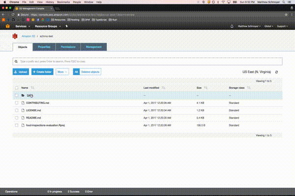

# S3 Interface

## Features

*IMPORTANT:* Besides the fact that this is extension itself is very immature, it also uses a proposed API which is subject to change and removal without notice from VS Code.

This VS Code extension provides an interface to view the contents of S3 buckets.



## Requirements

An AWS IAM [access key]http://docs.aws.amazon.com/IAM/latest/UserGuide/id_credentials_access-keys.html?icmpid=docs_iam_console) ID/Secret with `AmazonS3FullAccess` policy is needed for this extension to securely access an S3 bucket's objects.

This extension uses a proposed API which is only available on the [Insiders](https://code.visualstudio.com/insiders) version of VS Code.

## Running Locally

Download or clone.

```
$ git clone <git-url> s3-interface
$ cd s3-interface
$ npm install
```

Then run with VS Code debugger (`F5`).

## Extension Settings

Include if your extension adds any VS Code settings through the `contributes.configuration` extension point.

This extension contributes the following settings:

* `s3Interface.accessKeyId`: Access key ID
* `s3Interface.secretAccessKey`: Access key secret
* `s3Interface.bucketName`: Name of bucket to access.
* `s3Interface.region`: S3 bucket region. Defaults to 'us-east-1'.

## Known Issues/Limitations

The next steps are to address these issues:

1. Likely problems on buckets with 1000+ objects.
2. Can only view objects that are less than two files deep currently.
3. Can only view a single bucket from the configuration. Would be nice to dynamically select buckets.
4. Opening some files crash everything. That's bad. Fix that.
5. This should not make another request if file is already open.
6. Needs tests.
7. Get the [proposed API](https://github.com/Microsoft/vscode/issues/15485) into VS Code production.
